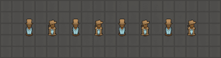
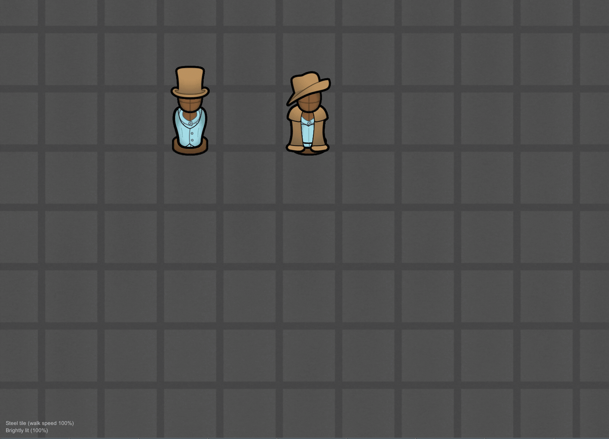
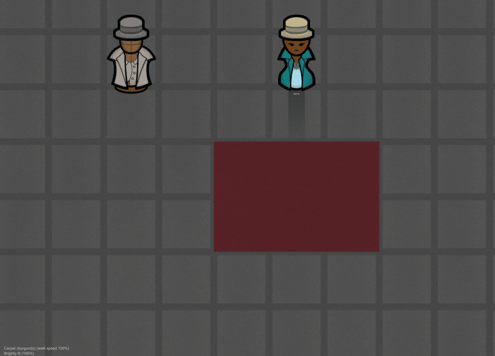
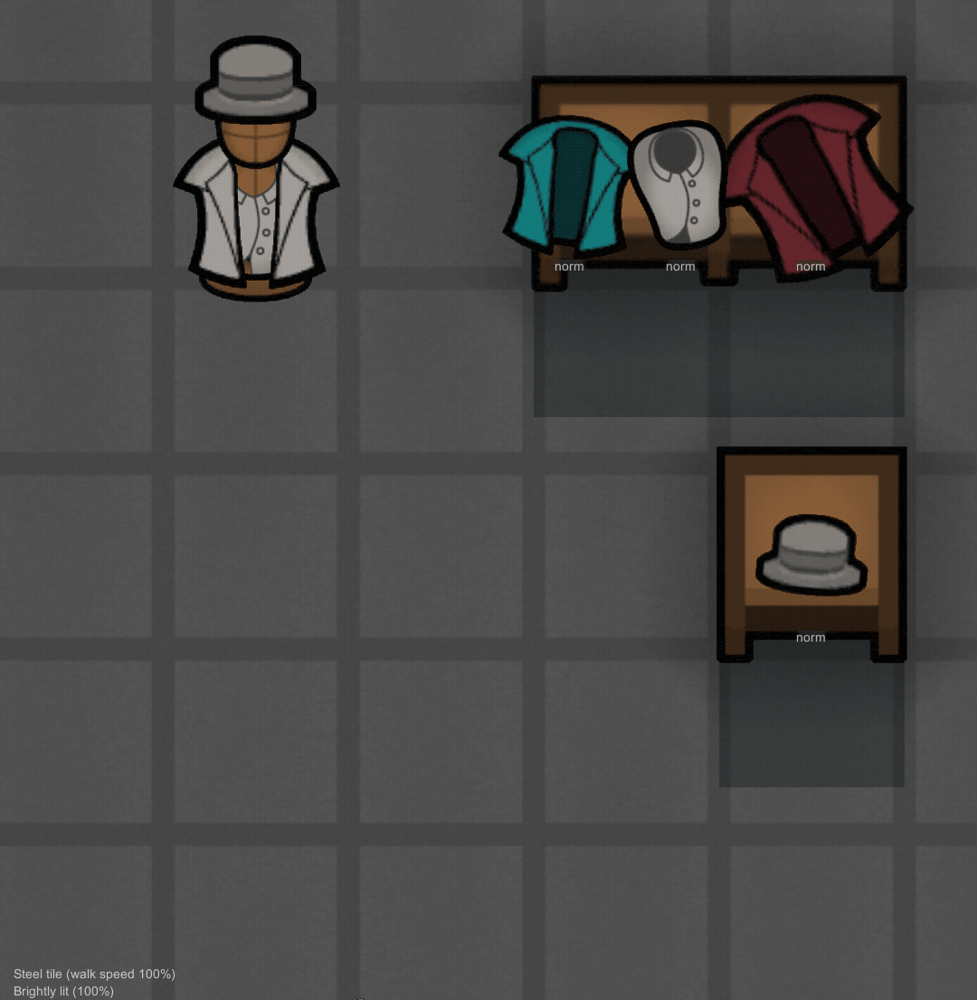
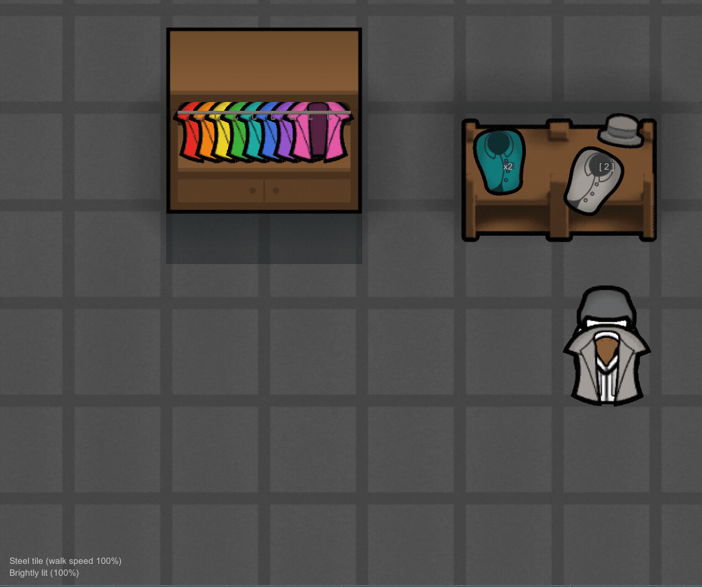

# Apparel Painter

> **No DLC and no dependencies required**, not even Harmony. It needs
> RimWorld 1.6 and something that can hold apparel: an Odyssey outfit stand,
> an Armor Rack, or any storage shelf. Any one is enough, and there is
> nothing to configure.

A RimWorld mod. Recolor apparel exactly where it is stored and displayed,
one garment at a time or a whole stand at once, with the choice previewed
live on the map while you make it. Designator painters recolor in bulk; this
is the per-item brush.



*The same wardrobe wall twice: as stocked, and after a painting pass. Same
stands, same garments, new palette, all done from the stands' own tabs.*

## How to use it

1. **Select anything that holds apparel** (an outfit stand, an armor rack,
   a shelf) and open its **Paint** tab. Every item gets a row: an info
   card, the item, a swatch showing its current color, and **Reset**, which
   returns a painted garment to its natural material color.
2. **Click a swatch** to open the color picker for that item, or **Paint
   all...** for everything on the building at once. Your choice previews on
   the actual map as you pick. **Accept** keeps it; **Cancel** or Esc puts
   everything back exactly as it was.
3. That is the whole loop. Painting is instant and free.



*Two stands: one painted a garment at a time from the saved swatches, the
other flooded with Paint all, which takes the shirt along with everything
else, so the per-item brush takes it back.*

## The picker

The base game's own color picker, pointed at things it never reaches, plus
the surface it lacks:

- **A brightness slider** under the wheel. The wheel picks hue and
  saturation only; the slider is the missing third axis.
- **RGB fields and a hex field.** The hex field doubles as a readout: when
  you are not typing in it, it shows the current color, ready to copy and
  carry to another stand. It also takes decimal triplets, bytes or floats.
- **The vanilla paint palette**: the same chart wall paint uses, so mods
  that add paint colors appear here automatically.
- **Your own saved swatches.** The `+` cell saves the current color;
  right-click removes one. They persist across saves and across games, and
  they live in RimWorld's config folder, not in any save file.

The window is a palette, not a modal: the map, the camera and the Paint tab
all stay live while it is open. Drag it out of the way by its top strip and
it remembers where you put it. Nothing closes it except Accept and Cancel.

## The droppers

Three ways to pick a color up instead of mixing it. Sampling only reads, so
a source does not need to be paintable itself:

- **Every swatch becomes an eyedropper** while a picker is open, including
  another building's. Select the next stand over and sip colors straight
  from its rows.
- **The Old color box has a dropper**: one click returns to the color the
  picker opened with.
- **The map dropper samples anything you can see**: pawns and corpses (a
  menu of what they are wearing), stands and racks (what they hold),
  furniture, items, walls, and floors (painted floors included). A cell
  with several sources opens a menu of the whole stack; bare floor samples
  in one click. It keeps sampling until you right-click or press Esc.



*Continuous sampling with the map dropper: a colonist's duster, then the
carpet she is standing on. Each sip lands in the open picker.*

## Where it works

- **Odyssey outfit stands**, including the Biotech kid stand and any modded
  stand built on the vanilla stand class, such as
  [Outfit Stands Plus](https://steamcommunity.com/workshop/filedetails/?id=3545172389).
- **[Armor Racks](https://steamcommunity.com/sharedfiles/filedetails/?id=1875828205)**,
  through an adapter built against its published source.
- **Any vanilla-style storage**: the base game's shelves,
  [[sbz] Neat Storage](https://steamcommunity.com/sharedfiles/filedetails/?id=3416243474),
  and most storage mods. The tab appears only when the building actually
  holds something paintable, so food crates and fridges stay clean.



*Stands and shelves in one room, everything recolored where it sits.*



*The modded neighbours: rainbow dusters on an [sbz] Neat Storage hanger, an
LWM Deep Storage clothing rack, and a stocked Armor Rack.*

Worth knowing, in the fine print:

- Rows are anything paintable, which is mostly apparel but also includes
  textile stacks. Painting a stack of cloth is cosmetic only: items crafted
  from it take the material's own color, as always.
- A weapon parked on a stand is listed but has no swatch; weapons generally
  take no dye, and hiding the row would misreport what the stand holds.
- Rows sort by name, then quality, then condition, the same order in the
  tab and in the dropper's menus. A shelf draws its stock in arrival order,
  so the list will not always match the shelf left to right.

## Requirements

- RimWorld 1.6. That is the whole list.
- No DLC is required, and neither is Harmony. Expansions and mods just add
  places to paint: Odyssey the outfit stand, Biotech the kid stand, Armor
  Racks and the storage mods their furniture. Plain vanilla shelves already
  work.

## Mod compatibility

There are no Harmony patches, no XML patches and no def edits: the mod
injects its tab at startup and touches nothing else. Load order does not
matter, and there is no patch for another mod to collide with.

- **[Dubs Paint Shop](https://steamcommunity.com/sharedfiles/filedetails/?id=1579516669)**
  is the complement, not the competition: it repaints en masse and covers
  floors, walls and buildings; this mod paints single garments, including
  inside containers its designators cannot reach. The droppers here also
  read Dubs floor paint, so a Dubs-painted floor is a valid color source.
- **Outfit Stands Plus** stands take the tab like any other stand.
- **Armor Racks** repaints live like everything else; its held armor
  refreshes on the rack the moment you pick.
- **[sbz] Neat Storage, Reel's Expanded Storage and other Adaptive Storage
  Framework mods** show painted items immediately. ASF bakes its shelf
  rendering, and this mod tells its renderer to re-bake after every paint.
- **LWM's Deep Storage** converts other mods' storage into its own units by
  default; the Paint tab survives the conversion and keeps its place beside
  LWM's Inventory tab.

If a storage or display mod you use does not show the tab, or shows stale
colors after painting, that is a bug worth reporting; name the mod.

## Save safety

Every color this mod applies is ordinary base-game apparel color state,
saved by the base game. Add the mod to an existing save freely. Remove it
and every painted item keeps its color; you only lose the tools. Nothing of
the mod's is written into save files at all. The saved swatches live in
RimWorld's config folder, beside your keybindings.

## Status

Not yet on the Steam Workshop; the first release is being prepared now. The
mod has been exercised in a live colony throughout development, and the
engine and mod surfaces it leans on are covered by an automated harness
(`devtools/run-harness.sh`) that runs before every release.

## How this is built

This mod is built with AI assistance, and it is worth being precise about
where.

**The code and these documents** are written with
[Claude Code](https://claude.com/claude-code). The repository is MIT-licensed
and contains all of it, so none of this has to be taken on trust.

**Nearly all the art is captured in game.** The mod ships two images: a
16-pixel eyedropper icon, drawn by a script, and the Workshop preview, which
is a screenshot with a title on it. Every gif and card on the store page is a
screenshot or screen recording of RimWorld running this mod. The sets were
built by the debug fixtures in `Source/`, so they rebuild on demand, and
[media/README.md](media/README.md) records the crops, timings and pipeline
that produced each asset. No diffusion model and no image pipeline are
involved anywhere.

**The engine claims are checkable.** Every assertion in
[docs/DESIGN.md](docs/DESIGN.md) about how RimWorld behaves cites the
decompiled assembly by file and line, at a stated game version.

**The behaviour is tested, and you can run the tests.**
`devtools/run-harness.sh` runs a suite inside RimWorld itself, against the
real engine rather than mocks, in about twenty seconds on the minimal mod
list (game launch, mod load and quit included). It asserts the surfaces this
mod depends on: the stand's private render cache, the color comp's quirks,
the picker's preview/cancel/accept state machine, floor paint resolution,
and the reflected internals of every supported mod, so when the game or a
neighbour updates, the specific ways this mod could break fail loudly in
testing rather than quietly on your shelf. What it covers and what it
deliberately does not is in [docs/TESTING.md](docs/TESTING.md).

## For modders

| Doc | Contents |
|---|---|
| [docs/DESIGN.md](docs/DESIGN.md) | What the mod interfaces with inside the game and why each piece took its shape: the tab injection and the shared-def commons it avoids, the container adapter seam, the four render caches that bake apparel color, the color comp's warts, the picker's layout mirror, the dropper's cell-stack targeting. Assumes programming, not RimWorld modding. |
| [docs/DEVELOPMENT.md](docs/DEVELOPMENT.md) | Build, engine navigation, the hot-reload rig and the rules it imposes, the scene rig behind the footage, upload staging, file map. |
| [docs/TESTING.md](docs/TESTING.md) | What the harness asserts, what it deliberately does not, the rules it follows, and the isolation that keeps it off your live game. |
| [AGENTS.md](AGENTS.md) | Short form of the invariants, for coding agents. |

## Building from source

```
dotnet build Source/ApparelPainter/ApparelPainter.csproj -c Release
```

Output goes to `Assemblies/`, which must contain only `ApparelPainter.dll`;
the game loads every DLL it finds there, and all package references are
compile-time only. A `-c Debug` build additionally wires in a hot-reload rig
for UI iteration (dev use only; see
[docs/DEVELOPMENT.md](docs/DEVELOPMENT.md)). Always build Release before
shipping or committing, which also sweeps the dev artifacts.

## Credit

[Dubs Paint Shop](https://steamcommunity.com/sharedfiles/filedetails/?id=1579516669)
by Dubwise owns the other half of this problem (repainting the world in
bulk) and is the reason this mod could stay narrow. khamenman's
[Armor Racks](https://steamcommunity.com/sharedfiles/filedetails/?id=1875828205)
ships its source code, which is what let its adapter be built on fact rather
than guesswork.

## License

MIT. See [LICENSE](LICENSE).

Portions of the materials used to create this content/mod are trademarks
and/or copyrighted works of Ludeon Studios Inc. All rights reserved by
Ludeon. This content/mod is not official and is not endorsed by Ludeon.
