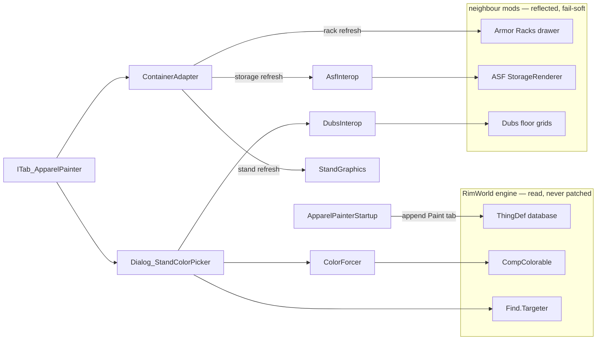

# Development

Build, debug and test loop. For why the mod is shaped the way it is, see
[DESIGN.md](DESIGN.md); for what the harness covers, see
[TESTING.md](TESTING.md).

## Requirements

| | |
|---|---|
| .NET SDK | 8.0 or later. The project targets `net472`; `Microsoft.NETFramework.ReferenceAssemblies` supplies the targeting pack, so no Framework install is needed on macOS or Linux. |
| RimWorld | 1.6. Optional for building, required for running and for engine navigation. |
| Harmony | Not used, at build time or runtime. |

No DLC is required to build or to run; Odyssey and the integration mods only
add families for the tab to appear on.

## Build

```bash
dotnet build Source/ApparelPainter/ApparelPainter.csproj -c Release
```

Output goes straight to `Assemblies/`, which must contain exactly one file.
Any non-Debug build runs a `CleanDevArtifacts` target that deletes anything
else it finds there, including hot-reload leftovers.

### Three configurations

| Config | `SCENES` | ECR | Job |
|---|---|---|---|
| `Debug` | yes | yes | hand-driving and UI iteration |
| `Media` | yes | no | footage: Release codegen, film-set stages present |
| `Release` | no | no | shipping, and the harness release gate |

`SCENES` compiles in the film-set stage builders and their `[DebugAction]`s.
**Release ships none of them** — each stage clears a multi-hundred-cell
footprint without confirmation, which has no business within a player's
reach. The harness *body* and its `-apparelpainter-harness` launch flag ship
in every configuration, deliberately, because the release gate must assert
against the literal dll players install.

**All three configurations write the same `Assemblies/ApparelPainter.dll`**,
so end every session — including filming sessions — with a Release build.
Committing a Debug or Media dll would ship the fixtures.

## Install

Symlink the repository into the game's `Mods/` directory as
`ApparelPainter`, then enable it in the in-game mod list. Enable
**Development mode** in Options for the debug log and god tools. Keyed
string changes need a game restart, like any def-layer change.

## Engine navigation

RimWorld publishes no API documentation, so go-to-definition into the engine
is the reference. `F12` on any engine type decompiles it in place when two
things line up:

1. The editor is allowed to decompile. In VS Code that is one setting, and
   `.vscode/` is gitignored, so add it yourself:

   ```json
   { "dotnet.navigation.navigateToDecompiledSources": true }
   ```

2. The build references assemblies that actually contain IL.

| References | Source | `F12` shows |
|---|---|---|
| `Assembly-CSharp.dll` from a local install | game folder | real decompiled bodies |
| `Krafs.Rimworld.Ref` | NuGet | signatures only, empty stubs |

The project picks between them on **install presence, not build
configuration**: if a RimWorld install is found, every configuration uses
the real DLLs; if not, it falls back to Krafs. Overrides:

| Goal | Flag |
|---|---|
| Non-standard install location | `RimWorldManaged=/path/to/Managed` (env var or `-p:`) |
| Reproduce a game-less build (a fresh clone, a CI runner) | `-p:DisableLocalGameRefs=true` |

There is no CI on this repository yet. The checks a pipeline would run — the
Release build against Krafs, the BBCode validation, the single-dll hygiene —
run locally as part of the release ritual, and the sibling repo's workflow
is the template when it lands here.

## Hot reload

Debug builds compile in Zetrith's EditCompileReload: a rebuild swaps changed
method bodies into the running game. Release references none of it.

```bash
dotnet build Source/ApparelPainter/ApparelPainter.csproj -c Debug
```

**UI and layout only.** Anything touching color state — writes, revert,
refresh plumbing — is verified on a clean Release restart, never in a
swapped session. This mod is UI-heavy, which is why the rig earns its keep
at all.

Rules that are not obvious:

- **Never build Release during a hot session.** The artifact sweep deletes
  the `.dll_orig` the rig depends on, killing reload until relaunch.
- **Structural edits need a restart**: instance fields, constructors,
  attribute changes, virtuals. Method bodies swap; shapes do not.
- A session is capped at 64 reloads. The 65th needs a restart.

### Language rules the rig imposes

ECR loads each reload as a new assembly and redirects methods into it, so
every member access from a swapped body is cross-assembly, and Unity's Mono
honours only `InternalsVisibleTo`. Hence the codebase-wide rules:

| Rule | Failure if broken |
|---|---|
| `internal`, never `private` | `FieldAccessException` at the first swapped access |
| No auto-properties | the backing field is always private, and no syntax widens it |

Within a single-assembly mod, `internal` and `private` are equivalent in
practice, so this costs nothing.

## Runtime knobs

Dev mode → **Tweak values** → `ApparelPainter`:

| Field | Default | Effect |
|---|---|---|
| `PreviewWhileDragging` | `false` | Push live preview per drag frame instead of per commit. Feel-testing only: every unique color mints a permanent `GraphicDatabase` entry, so leave it off. |

Player-facing settings are the saved swatches only, managed inside the
picker itself (`+` saves, right-click removes). There is deliberately no
Options entry: `SettingsCategory` stays empty, because a window with one
list in it is worse than the list living where it is used. Settings scribe
to RimWorld's config file, never to saves.

## Scenes and media

The store-page footage is filmed in game on reproducible sets. The stage
builders (`DebugTools_*.cs`, `SCENES` builds only) each construct a lit,
stocked film set in one debug action — the wardrobe wall, the core-loop
pair, the dropper set, the storage and integrations scenes.

```bash
devtools/run-scene.sh              # isolated interactive instance, Debug build
devtools/run-scene.sh --media      # the filming build: SCENES, no ECR in frame
devtools/run-scene.sh --bridge     # + scripted-capture bridge
devtools/run-scene.sh --alongside  # start it beside a running game
```

`run-scene.sh` is the observation twin of `run-harness.sh`: same isolation
(`dist/scenedata`), same refusal to touch a running game. It loads a filming
mod list (camera, HUD and apparel mods, all DLCs, and the storage
integrations) rather than the minimal one. `--bridge` adds a scripted
capture server for driven shots; the drivers live in `devtools/bridge/`.

Every asset's exact recipe — scene, driver, crop, timing, assembly — is
recorded in [media/README.md](../media/README.md) at capture time. That file
is the authority on how any image on the store page was produced;
`devtools/make-ab.sh` (the before/after crossfade) and
`devtools/bbcode-preview.py` (the description validator) are the shared
cutting tools.

## Testing

Behaviour is verified by the regression harness, inside the real engine:

```bash
devtools/run-harness.sh          # three-mod list — the iteration loop, ~20 s
devtools/run-harness.sh --full   # your own mod list, copied — the release gate
devtools/run-harness.sh --alongside  # a second instance beside a live game
```

One command, no hands: builds Release, launches an isolated instance, waits
for it to run every case and quit itself, prints the report, exits non-zero
on failure. The integration cases (Dubs, Armor Racks, ASF) SKIP on the
minimal list and assert on `--full`. What the cases cover, what they
deliberately do not, and the isolation rules are all in
[TESTING.md](TESTING.md).

**Keep the window focused.** RimWorld is throttled hard in the background,
and a backgrounded loading screen can stall outright; the script allows
1200 s before giving up, and a run that looks hung is usually starved, not
broken.

## Workshop upload

Deliberately manual, but **never through the dev symlink**. RimWorld's
uploader publishes the mod's folder verbatim: `Workshop.cs` hands
`hook.Directory.FullName` to `SteamUGC.SetItemContent`, and
`PrepareForWorkshopUpload()` has an empty body. Since `Mods/ApparelPainter`
is a symlink to this repository, uploading through it would ship `Source/`,
`media/`, `dist/` and the entire `.git` directory to subscribers.

`devtools/publish-workshop.sh` automates the whole swap:

```bash
devtools/publish-workshop.sh            # stage + install, the safe default
devtools/publish-workshop.sh stage      # build Release + assemble dist/ApparelPainter
devtools/publish-workshop.sh install    # swap it into Mods/, dev symlink aside
devtools/publish-workshop.sh restore    # dev symlink back, item id recovered
```

`stage` assembles the allowlist —

```
About Assemblies Languages Textures docs LICENSE README.md
```

— sweeps `.DS_Store` and any `.dds` shadows out of the staged copy, and
refuses stray dlls under `Assemblies/`. `install` replaces the dev symlink
and prints the one confirmation Steam never gives: the item id (NONE is
correct on the *first* publish and on no other), the staged size, the
top-level listing, and the full browser checklist for the manual tail. That
printed checklist is the authority; the engine facts below are why it
exists. `restore` recovers `About/PublishedFileId.txt` into the repo for
committing.

Three engine facts shape the manual tail:

- **The description is written once.** `SetItemDescription` is called only
  on the create branch, so `media/steam-description.bbcode` is pasted into
  the Steam web editor by hand, and no later in-game update will push it.
  `SetItemTitle` and `SetItemPreview` are not gated — the title and
  `About/Preview.png` are pushed on every update.
- **Only `About/Preview.png` uploads.** Gallery images (the animated
  preview, the cards) are added on the item page in the browser; the game
  never calls `AddItemPreviewFile`.
- **`About/PublishedFileId.txt` is written into the upload root** after a
  successful publish, and the create-vs-update branch keys off it. Copy it
  back into the repo and commit it, or the next upload mints a duplicate
  listing.

### What goes in About.xml, and what does not

`About.xml`'s `<description>` is the in-game mod-list blurb — read by
someone standing in the mod list, deciding whether this mod is why their
game changed. It carries what changes what a player does: what the mod
adds, where it works, what it needs (nothing). It deliberately does **not**
carry the meta — the AI-assistance disclosure, the Ludeon disclaimer, the
gifs — which lives on the Workshop page and in the README, the surfaces
where the mod is *distributed*. The source link is `About.xml`'s `<url>`,
the field the game renders as a button.

## Logs

Dev log in game, or the full trace at:

```
~/Library/Logs/Ludeon Studios/RimWorld by Ludeon Studios/Player.log
```

Everything this mod writes is prefixed `[ApparelPainter]`. In normal play it
writes nothing at all; the prefix appears only for the startup tripwire (a
missing engine member) and the harness report.

## File map



### `Source/ApparelPainter/`

| File | Role |
|---|---|
| `ApparelPainterStartup.cs` | Class-keyed tab injection onto the three families, both def lists, Contents-before-Paint ordering. |
| `ITab_ApparelPainter.cs` | The Paint tab: rows, swatches, per-row Reset, Paint all / Reset all, the swatch-eyedropper mode, the canonical display sort. |
| `ContainerAdapter.cs` | The seam: `StandAdapter`, `ArmorRackAdapter`, `StorageAdapter` — listing, refresh, spawned-ness, the tab-visibility gate. |
| `Dialog_StandColorPicker.cs` | The picker subclass: the four bands, the layout mirror, live preview on commit, snapshot revert, saved swatches, direct input, the map dropper. |
| `ColorForcer.cs` | Wart-safe color writes: the white-wart nudge, reset-to-natural, wearer dirtying. Every write in the mod goes through here. |
| `StandGraphics.cs` | Reflection bridge to the stand's private `RecacheGraphics`, with a load-time tripwire when the engine moves it. |
| `AsfInterop.cs` | Reflection bridge to ASF's render cache. Present-only, public members, degrades silently. |
| `DubsInterop.cs` | Read-only bridge to Dubs Paint Shop's floor paint, both getters, reload wart handled. |
| `FloatMenu_Ordered.cs` | A FloatMenu that keeps caller order, so the dropper menu's section headers stay in place. |
| `ApparelPainterMod.cs` | Mod entry and ModSettings (saved swatches). Deliberately no settings window. |
| `ApparelPainterTex.cs` | Startup-loaded texture handles: the dropper icon. |
| `Harness.cs` | The regression suite and its flag-gated boot. Body ships in every configuration; see [TESTING.md](TESTING.md). |
| `DebugTools_*.cs` | `SCENES` only. The film-set stages and scene builders behind every gif and card. Destructive by design; never shipped. |

### Content

| Path | Contents |
|---|---|
| `About/About.xml` | Metadata. No dependencies; soft `loadAfter` ordering only. `Preview.png` is needed only for Workshop upload. |
| `Languages/English/Keyed/` | Tab, picker and tooltip strings. |
| `Textures/ApparelPainter/UI/` | The dropper icon — the mod's one shipped texture, generated by script. |
| `Assemblies/` | Build output. Exactly one dll. |

### `devtools/`

Not shipped — the release allowlist is `About Assemblies Languages Textures
docs LICENSE README.md`.

| Script | Does |
|---|---|
| `run-harness.sh` | Runs the test suite headless in an isolated instance. `--full`, `--alongside`. |
| `run-scene.sh` | Isolated interactive instance with the filming mod list. `--media`, `--bridge`, `--full`, `--alongside`. |
| `publish-workshop.sh` | Stages a Workshop upload out of the working tree (allowlist, `.dds` sweep, stray-dll check) and swaps it into `Mods/`. `stage`, `install`, `restore`. |
| `make-ab.sh` | Before/after crossfade gif from an aligned capture pair. |
| `bbcode-preview.py` | Validates the store description and renders a local preview; reports the character count against Steam's limit. |
| `bridge/` | Scripted-capture drivers for the driven shots; see `media/README.md`. |
